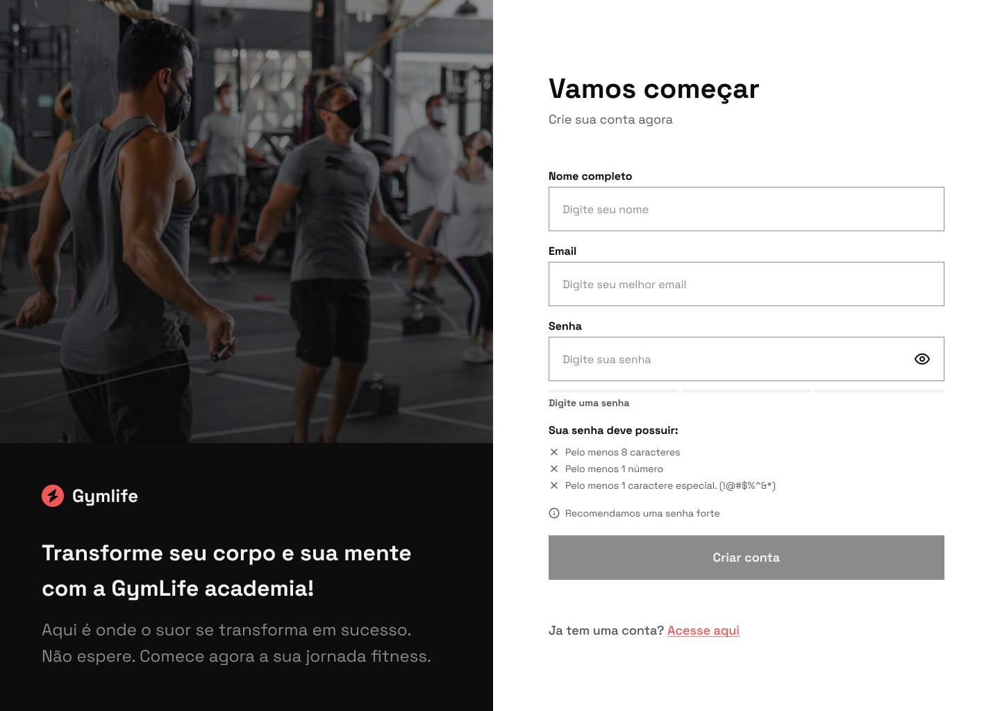

# 

## 🔴 Live
https://gymlife-health.netlify.app/

## 💻 Project

Página de cadastro para academia.

O intuido desse projeto foi desenvolver um formuário com validações (email e senha) e praticar algumas microinterações como: efeito no olho ao mostrar e esconder a senha, mostrar erro no input inválido e validar o grau de dificuldade da senha digitada.

>

## 🔖 Layout and Design

Prototype developed by <a href="https://www.paulojanai.com/" style="color: #00a0df" target="_blank">me</a>. See full prototype on [Figma](https://www.figma.com/file/0r9bZxbSauKBwlqnJTMIvY/GymLife?type=design&node-id=1%3A36&mode=design&t=YyXCWo5Bbq8R9Oe1-1).

## 🚀 Technologies

This project was developed with the following technologies:

- HTML & CSS (Sass)
- GSAP
- JavaScript

>
